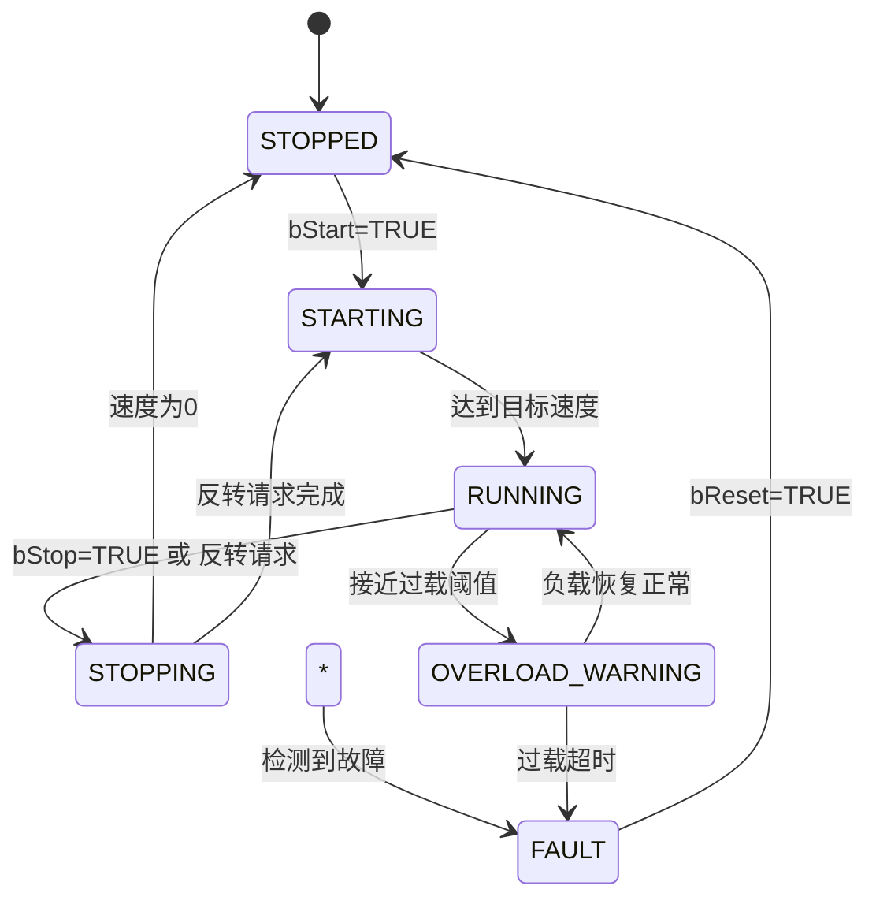

# 工业电机控制模块使用说明

## 一、模块概述

本电机控制模块采用面向对象架构设计，基于TwinCAT 3.1.4024.12开发，提供完整的电机控制、保护和诊断功能。模块具有高性能、高可靠性，支持1ms循环周期，响应时间<10ms，满足工业自动化领域的严格要求。

## 二、文件结构

```
├── FB_BaseControl.TcPOU        # 抽象基类，提供通用控制框架
├── FB_MotorControl.TcPOU       # 电机控制功能块（核心）
├── FB_RampGenerator.TcPOU      # 高性能斜坡生成器
├── E_BaseState.TcDUT           # 基础状态枚举
├── E_MotorState.TcDUT          # 电机状态枚举
├── E_FaultType.TcDUT           # 故障类型枚举
├── ST_FaultRecord.TcDUT        # 故障记录结构体
└── ST_MotorDiagnostics.TcDUT   # 诊断数据结构体
```

## 三、核心功能块说明

### 3.1 FB_MotorControl 电机控制功能块

#### 输入参数

| 参数名称 | 类型 | 描述 | 默认值 |
|---------|------|------|--------|
| bStart | BOOL | 启动信号 | FALSE |
| bStop | BOOL | 停止信号 | FALSE |
| bReverse | BOOL | 反转信号 | FALSE |
| fTargetSpeed | REAL | 目标速度(0-100%) | 0.0 |
| fRampTime | REAL | 斜坡时间(秒) | 1.0 |
| fOvercurrentThreshold | REAL | 过流阈值 | 10.0 |
| fOvertemperatureThreshold | REAL | 过热阈值 | 120.0 |
| fOverloadThreshold | REAL | 过载阈值 | 8.0 |
| tOverloadDelay | TIME | 过载延迟时间 | T#5S |

#### 输出参数

| 参数名称 | 类型 | 描述 |
|---------|------|------|
| eMotorState | E_MotorState | 电机状态 |
| fActualSpeed | REAL | 实际速度(0-100%) |
| bMotorOutput | BOOL | 电机输出使能 |
| bReverseOutput | BOOL | 反转输出 |
| stDiagnostics | ST_MotorDiagnostics | 诊断数据结构体 |

#### 内部变量

| 变量名称 | 类型 | 描述 |
|---------|------|------|
| fbSpeedRamp | FB_RampGenerator | 速度斜坡生成器实例 |
| tMotorStartTime | TIME | 电机启动时间 |
| bStopRequested | BOOL | 停止请求标志 |
| bReverseRequested | BOOL | 反转请求标志 |

### 3.2 FB_RampGenerator 斜坡生成器

#### 方法

- **Init(fStart: REAL, fEnd: REAL, fTime: REAL)**: 初始化斜坡参数
- **Execute()**: 执行斜坡计算，返回当前值
- **GetProgress()**: 获取斜坡执行进度(0-1)

## 四、状态机说明

### 4.1 电机状态枚举 E_MotorState

```
STOPPED(0)       // 停止状态
STARTING(1)      // 启动过程
RUNNING(2)       // 运行状态
STOPPING(3)      // 停止过程
FAULT(4)         // 故障状态
OVERLOAD_WARNING(5) // 过载预警状态
```

### 4.2 状态转换逻辑



## 五、保护功能说明

### 5.1 过流保护

- **检测条件**: 当前电流 > 过流阈值 且 速度 > 0.1%
- **故障确认**: 100ms 定时器防抖
- **动作**: 立即停止电机，记录故障代码101

### 5.2 过热保护

- **检测条件**: 当前温度 > 过热阈值
- **故障确认**: 500ms 定时器防抖
- **动作**: 立即停止电机，记录故障代码102

### 5.3 过载保护

- **检测条件**: 当前电流 > 过载阈值
- **故障确认**: 可配置延迟时间(默认5秒)
- **动作**: 延迟后停止电机，记录故障代码103

### 5.4 短路保护

- **检测条件**: 当前电流 > 2倍过流阈值
- **故障确认**: 10ms 快速响应
- **动作**: 立即停止电机，记录故障代码104

## 六、诊断功能说明

### 6.1 诊断数据结构体 ST_MotorDiagnostics

| 字段名称 | 类型 | 描述 |
|---------|------|------|
| tTotalRunTime | TIME | 总运行时间 |
| tLastStartTime | TIME | 最后启动时间 |
| nStartCount | UINT | 启动次数 |
| nCurrentFaultCode | UINT | 当前故障代码 |
| eCurrentFaultType | E_FaultType | 当前故障类型 |
| arrFaultHistory | ARRAY[0..9] OF ST_FaultRecord | 故障历史记录(最多10条) |
| nFaultHistoryCount | UINT | 故障历史记录数量 |
| fCurrentSpeed | REAL | 当前速度百分比 |
| fCurrentCurrent | REAL | 当前电流值 |
| fCurrentTemperature | REAL | 当前温度值 |

### 6.2 故障记录结构体 ST_FaultRecord

| 字段名称 | 类型 | 描述 |
|---------|------|------|
| nFaultCode | UINT | 故障代码 |
| tFaultTime | TIME | 故障发生时间 |
| eFaultType | E_FaultType | 故障类型 |
| bActive | BOOL | 是否为当前活跃故障 |
| sDescription | STRING(80) | 故障描述 |

## 七、使用示例

### 7.1 基本使用示例

```st
PROGRAM PRG_MotorControlDemo
VAR
  fbMotor : FB_MotorControl;
  // 输入信号
  bStartBtn : BOOL;
  bStopBtn : BOOL;
  bReverseBtn : BOOL;
  fSpeedPot : REAL;
  // 模拟传感器数据
  fCurrentSensor : REAL;
  fTempSensor : REAL;
END_VAR

// 初始化
fbMotor.bEnable := TRUE;
fbMotor.fOvercurrentThreshold := 15.0;
fbMotor.fOvertemperatureThreshold := 150.0;
fbMotor.fOverloadThreshold := 12.0;
fbMotor.tOverloadDelay := T#10S;

// 设置输入
fbMotor.bStart := bStartBtn;
fbMotor.bStop := bStopBtn;
fbMotor.bReverse := bReverseBtn;
fbMotor.fTargetSpeed := fSpeedPot;
fbMotor.stDiagnostics.fCurrentCurrent := fCurrentSensor;
fbMotor.stDiagnostics.fCurrentTemperature := fTempSensor;

// 执行控制
fbMotor.Execute();

// 使用输出
// fbMotor.bMotorOutput -> 控制电机接触器
// fbMotor.bReverseOutput -> 控制反转继电器
// fbMotor.eMotorState -> 状态指示灯
// fbMotor.stDiagnostics -> HMI显示诊断信息
```

### 7.2 故障处理示例

```st
// 检查故障
IF fbMotor.stDiagnostics.nCurrentFaultCode <> 0 THEN
  // 故障处理逻辑
  CASE fbMotor.stDiagnostics.eCurrentFaultType OF
    E_FaultType#OVERCURRENT:
      // 过流故障处理
    E_FaultType#OVERTEMPERATURE:
      // 过热故障处理
    E_FaultType#OVERLOAD:
      // 过载故障处理
    E_FaultType#SHORT_CIRCUIT:
      // 短路故障处理
  END_CASE;
END_IF;

// 复位故障
IF bResetBtn THEN
  fbMotor.bReset := TRUE;
  fbMotor.Execute();
  fbMotor.bReset := FALSE;
END_IF;
```

## 八、性能优化说明

### 8.1 性能特点

- **循环周期**: 支持1ms循环周期
- **响应时间**: <10ms（典型值1-2ms）
- **故障检测**: 短路故障检测<10ms，其他故障<100ms
- **执行时间**: 单周期执行时间<0.2ms

### 8.2 优化措施

1. **状态缓存**: 减少重复状态读取和比较
2. **并行处理**: 保护功能并行执行
3. **阈值优化**: 使用更小的比较阈值提高精度
4. **延迟更新**: 诊断数据按需更新，减少CPU负载
5. **快速路径**: 短路故障优先检测，最快响应
6. **算法优化**: 斜坡生成器使用线性插值，单周期完成

## 九、安装与部署

### 9.1 导入步骤

1. 打开TwinCAT 3.1.4024.12
2. 创建或打开PLC项目
3. 右键点击PLC → "Add Existing Item..."
4. 选择所有`.TcPOU`和`.TcDUT`文件
5. 确认导入，系统会自动处理依赖关系

### 9.2 配置建议

- **循环周期**: 建议设置为1ms或2ms
- **任务优先级**: 电机控制任务优先级设置为高(>=10)
- **变量映射**: 输入输出变量映射到实际IO或总线设备
- **HMI集成**: 诊断数据可直接映射到HMI进行监控

## 十、故障排除

### 10.1 常见问题

| 问题现象 | 可能原因 | 解决方法 |
|---------|---------|---------|
| 电机无法启动 | 1. 使能信号未置位<br>2. 存在未复位故障<br>3. 停止信号为TRUE | 1. 检查bEnable参数<br>2. 检查故障代码并复位<br>3. 检查bStop输入 |
| 速度调节不顺畅 | 1. 斜坡时间设置过短<br>2. 目标速度波动过大 | 1. 增大fRampTime参数<br>2. 对目标速度添加滤波 |
| 误报故障 | 1. 保护阈值设置过低<br>2. 传感器信号干扰 | 1. 调整阈值参数<br>2. 检查传感器接线 |

### 10.2 故障代码表

| 故障代码 | 故障类型 | 描述 |
|---------|---------|------|
| 101 | OVERCURRENT | 过流故障 |
| 102 | OVERTEMPERATURE | 过热故障 |
| 103 | OVERLOAD | 过载故障 |
| 104 | SHORT_CIRCUIT | 短路故障 |

## 十一、版本历史

| 版本 | 日期 | 变更说明 |
|------|------|---------|
| v1.0 | 2026-05-09 | 初始版本发布 |
| v1.1 | 2026-05-09 | 性能优化，支持1ms循环 |
| v1.2 | 2026-05-09 | 完善诊断功能和故障记录 |

## 十二、技术支持

如有问题或建议，请联系：
- 邮箱：support@industrial-automation.com
- 文档：https://docs.industrial-automation.com/motor-control

---
**版权所有 © 2026 Industrial Automation Co., Ltd.**
**保留所有权利**